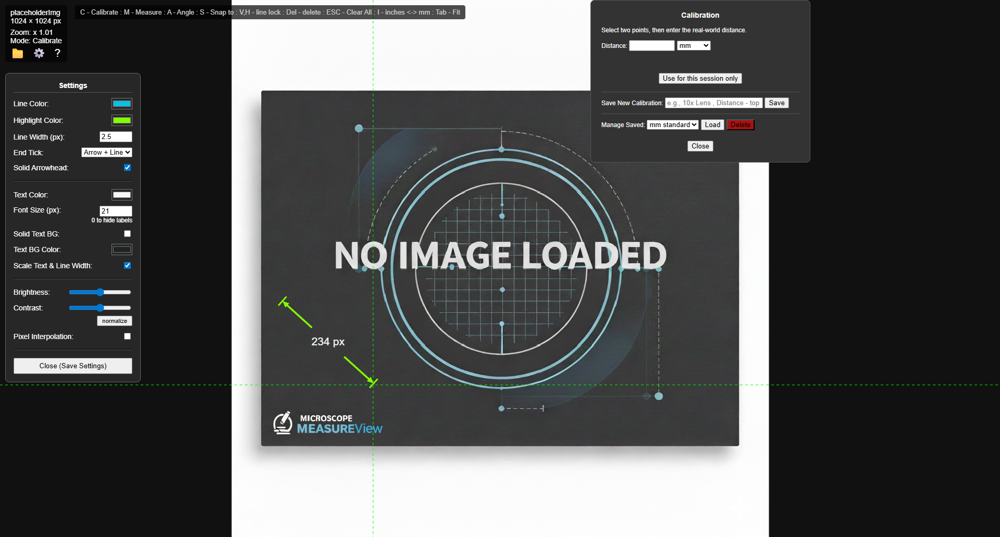

# MeasureView + WiScope AD409 🚀

## Overview
A Chrome extension containing two tools. The first is **MeasureView** which can be used alone or via the AD409 microscope control. This is a well featured  image Measurement tool that I originally built as a stand-alone extension and  may be released as that as it develops, easily calibrated in any measurement units and used to measure circuit board and other features where a degree of precision is required.  

 The second tool **WiScope AD409** is an experimental Wi-fi controller that allows Wi-Fi control of the Andonstar AD409 Inspection/soldering microscope from your PC. Use it to manage the SD card and change microscope settings, show MJPEG low res preview and initiate/download snapshots/videos and seamless integration with **MeasureView**. I built this because the official AD409 software only supports wired USB connections. This project provides a more flexible, wireless alternative.

 ## ✨ MeasureView Features

- ✅ Zoom and pan images with mouse or keyboard  
- ✅ Load/save images and measurements (JSON or combined image)  
- ✅ Measure distances and angles in px, mm, inches, or custom units (easy calibration with a ruler image)  
- ✅ **Snap-to** and **line lock** features for precise alignment with other measurement points 
- ✅ Move/place measurement endpoints and labels  
- ✅ Multi-language support  

---

## WiScope AD409 notes
 There is limited tech information available online about the **Andonstar AD409** but whilst testing It was found it uses a **Novatek camera and chipset** who also make dash/web cams, I found some of the Wi-Fi command syntax and codes from online sources that are used on some of their webcams. By probing the microscope with a web browser and Wireshark I found other AD409 specific Wi-Fi commands that allow control of this microscope, you can find those commands listed in a txt file within this repository.  
 
⚠️ **Disclaimer / Warning**
- Be cautious about using some of those commands as some of them have unknown effects and others (such as initiating a firmware update) may potentially **brick your microscope**  (i.e. corrupt or delete your microscopes own firmware which is not replaceable/available from anywhere). 
- Andonstar may have changed or may decide to change these commands on earlier/later versions of the AD409 than my own, so whilst this software works ok on my AD409, I can make no guarantees it will work ok for your AD409 microscope version, this is a unofficial/unsupported app I wrote for personal use.    

---

## How to enable Microscope Wi-Fi and connect (after installing extension). 
1. Insert a **quality SD card** into the microscope before proceeding.
2. Enable Wi-Fi from the AD409’s menu. The scope’s SSID and password will appear (default password is usually `12345678`).
3. On your PC Wi-Fi 'show available networks' scan for the microscope’s SSID and connect using the password.
4. Connection can be verified by entering the microscope’s IP address into your browser (default: `http://192.168.1.254` ). The microscopes basic SD card home page should appear.
5. If your PC relies on Wi-Fi for internet access and you want to connect to both the microscope and the internet simultaneously you will need a second Wi-Fi dongle.   
   note : The AD409 may also have an undocumented Wi-Fi client mode (see known commands.txt), enabling it to scan for and join a Wi-Fi server e.g., router, but it's unknown how to initiate a connection using this at present.
6. Open this extension from chromes extension tool bar and 'connect' to scope, optional limit the extensions 'Site access' to only the scopes IP address from chromes extension settings. 
----

## Installation
 1- [Download the latest version from the releases page ](https://github.com/cloudspotter-Eng/MeasureView-WiScope-AD409/releases)
 and Unzip.   
2- Open Chrome and go to chrome://extensions/.  
3- Enable Developer mode (toggle in the top right).  
4- Click Load unpacked and select the Unzipped extension folder you created.  
5- Done! 🎉  

Contributing  
All Feature requests will be considered. For bug reports, please contact or open an issue.

### MeasureView Screenshot

 

### WiScope AD409 Screenshot

 

---

